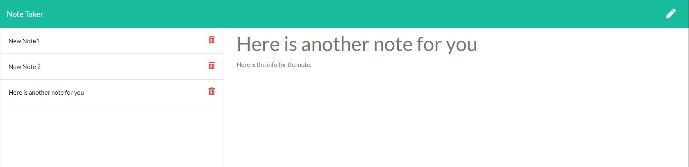

# rut-hw8-notetaker
*Store and organize your thoughts using express.js*

## Description
An application which allows a user to enter, save, and retrieve notes.
[Check it out now!](https://frozen-garden-80238.herokuapp.com/)

## How to use this application
* Navigate to the [note-taker page](https://frozen-garden-80238.herokuapp.com/)
* Click the "Get Started" button to be taken to the notes screen
* View your old notes by clicking on them from the left hand navigation
* Delete your old notes by clicking on the trash can next to the stored note.
* Add a new note by entering a title and body-- click the save button to save!

## Local Installation & Usage Instructions
This app was built using [Express.js](https://expressjs.com/)
* Clone the repo to your local disk.
* From the cloned directory run `npm init -y`
* Then pull in the necessary dependencies by running `npm install`
* To run the application, run `node server.js`
* Navigate to https://localhost/3000 to view the app live

## Contribution Instructions
*Not currently looking for contributions, but feel free to download and run it locally.*

### Supporting Images

